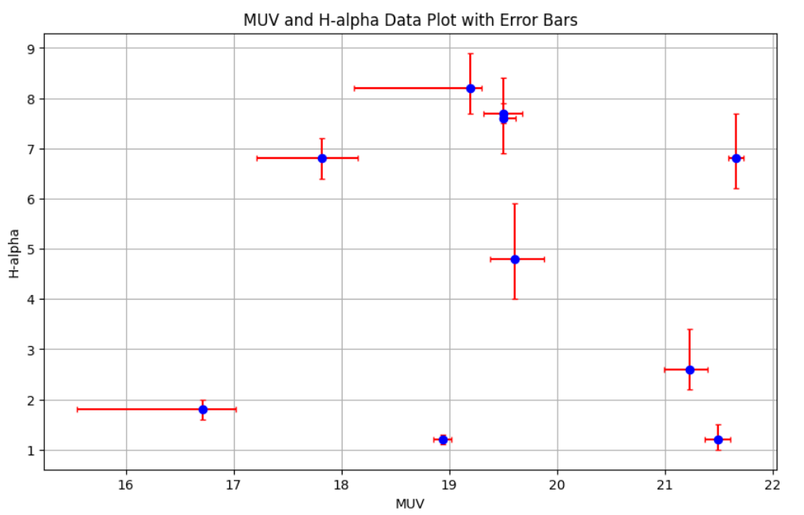
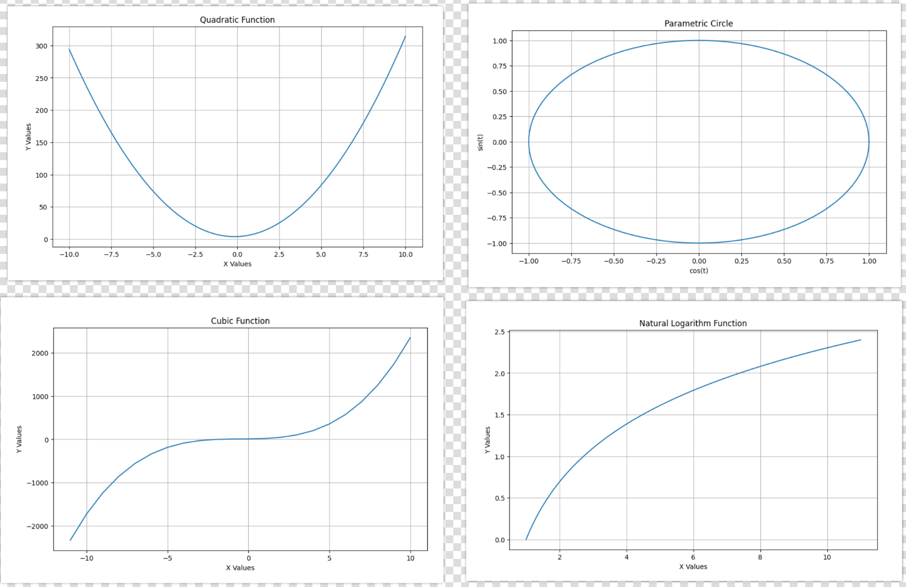
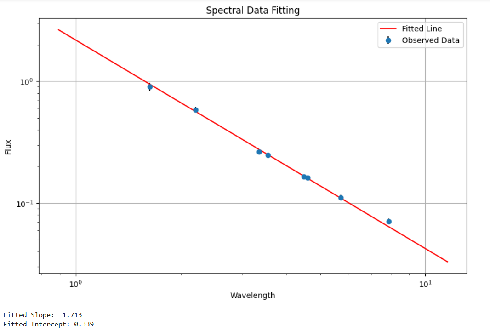
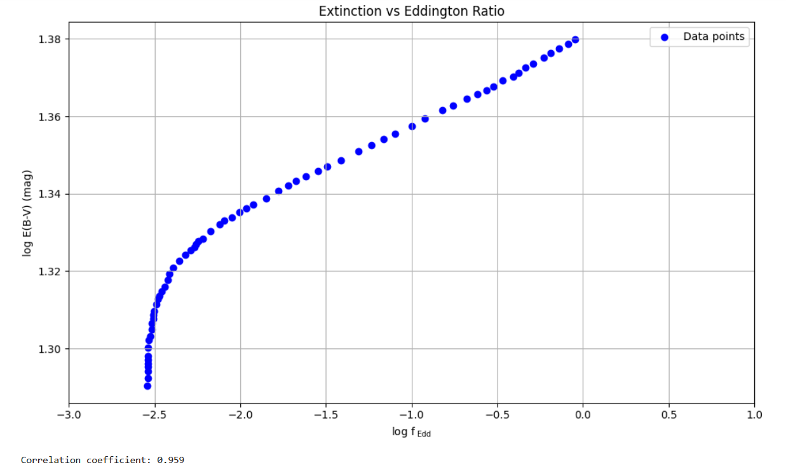
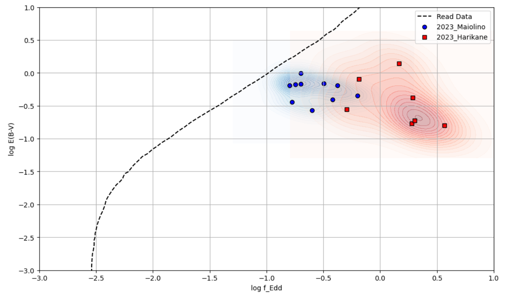
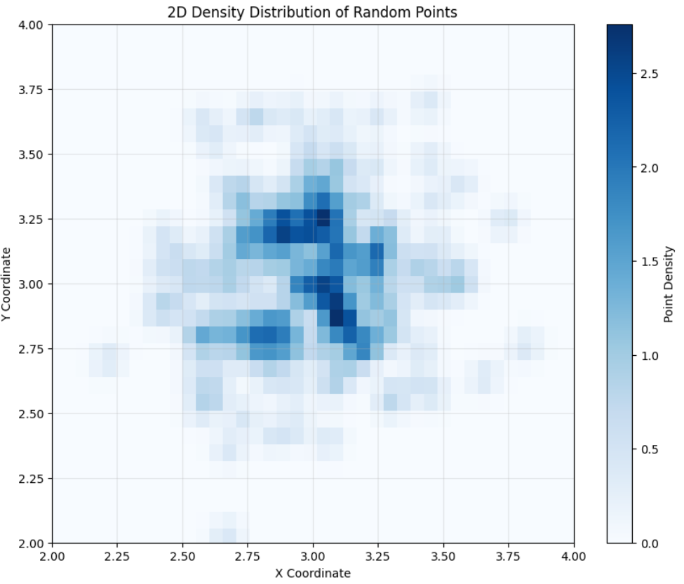

# Data Analysis and Plotting Project

This project contains various scripts for data analysis and plotting using Python. The scripts utilize libraries such as `numpy`, `matplotlib`, and `scipy` to perform different types of data analysis and generate visualizations.

## Scripts Overview

### `1_muv_halpha_analysis.py`
Analyzes MUV and H-alpha data and generates a plot with error bars.



### `2_function_plotting.py`
Contains functions to plot various mathematical functions including quadratic, cubic, logarithmic, and trigonometric functions.



### `3_spectral_fitting.py`
Performs spectral data analysis and fits a linear function to the data.



### `4_eddington_analysis.py`
Analyzes Eddington ratios and extinctions, and generates a scatter plot with a correlation coefficient calculation.



### `5_density_comparison.py`
Compares density data from different sources and generates contour plots.



### `6_density_plotting_2d.py`
Generates a 2D density plot from normally distributed random data using Kernel Density Estimation (KDE).



## Installation

1. Clone the repository:
    ```sh
    git clone https://github.com/PratikPaudel/your-repo-name.git
    cd your-repo-name
    ```

2. Create a virtual environment and activate it:
    ```sh
    python -m venv venv
    source venv/bin/activate  # On Windows use `venv\Scripts\activate`
    ```

3. Install the required dependencies:
    ```sh
    pip install -r requirements.txt
    ```

## Usage

Run any of the scripts directly using Python. For example, to run the MUV and H-alpha analysis script:
```sh
python scripts/1_muv_halpha_analysis.py